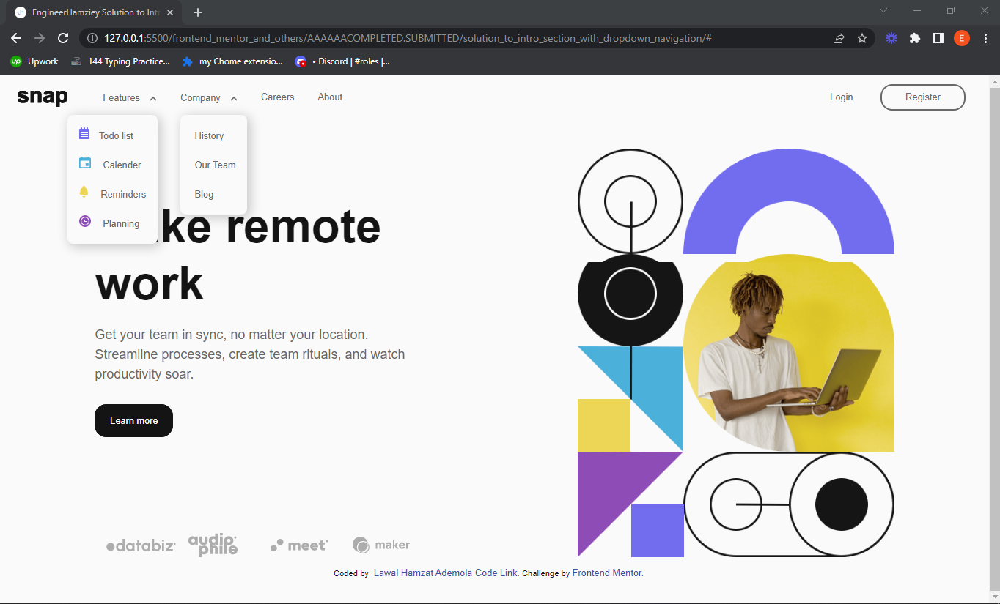
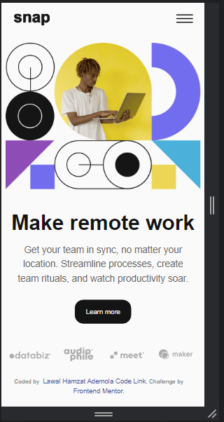

# Solution To Intro section with dropdown navigation By Engineer Hamziey

## Table of contents

- [What is FrontEnd Mentor](#what-is-frontend-mentor)
- [The challenge](#the-challenge)
  - [Extra things I added](#extra-things-i-added)
  - [Screenshot](#screenshot)
  - [How I made the website accessible](#how-i-made-the-website-accessible)
- [Built with](#built-with)
- [Author](#author)
- [Links](#links)
- [Acknowledgments](#acknowledgments)
- [To give me feedback](#)


## Welcome to my solution Readme :relaxed:

This is a solution to the [Intro section with dropdown navigation challenge on Frontend Mentor](https://www.frontendmentor.io/challenges/intro-section-with-dropdown-navigation-ryaPetHE5).
 [Frontend mentor](https://www.frontendmentor.io) ***is a site that provide us with free UI/UX designs to practice our coding skills.***
 [Frontend mentor challenges](https://www.frontendmentor.io/challenges) help you improve your coding skills by building realistic projects. 

### The challenge

Users should be able to:

* [x] View the relevant dropdown menus on desktop and mobile when interacting with the navigation links
* [x]  use keyboard(tab key) or mouse to interact with all navavigation links 
* [x] View the optimal layout for the content depending on their device's screen size
* [x] See focus states and hover states for all interactive elements on the page


### Extra things I added
- My navigation links and image hover style on desktop:<br/>
  ***I use javaScript mouse-tracking to add a dark circle behind each nav links and the dark circle follows the, the same is done on the image using grayscale backdrop***
- I used SVG for the text/logo "snap" and animates it.

### How I made The website accessible

- I added the Skip to main content button to make navigation easier for disabled people who can only use the tab key(or ***mouth wand***) but can't use mouse.

- I ensure that the Arial-expanded property of the menu buttons are updated when needed to help screenreader users to know when the expandable menu is opened and closed

- By Making every interactive elements focusable and giving them :focus-visible styles to allow keyboard(tab key) users to know which button/link they on.

- I added aria-label="Menu" the menu button and as plan B(because of old screen readers) I also added Menu as text within the button, so that the Screen Readers will announce it as "menu" even though the button text is visually hidden.

- I ensure that all buttons/target size are about 44px x 44px, some might appear like they are not up to that but there is actually a hidden/transparent padding around it that make it up to 44px x 44px.

-  I added aria-hidden="true" to decorative images and leaved the alt attribute empty, so screen-readers can ignore it and and won't bore blind users with unneccesary information.<br>
An example is shown below:
```html

```

- I added extra information(and made them visually hidden) to focusable elements to make blind users tab key(or mouth wand) and screenreaders have a better experience.
  ***I use a span with class visually-hidden, and made it visually hidden in my CSS*** This will make blind user keep track of how many items are on the list and which on they are on.<br>
  An example is shown below:
```html
<!-- EXAMPLE 1: -->
<ul>
    <li>
      <a class="btn" href="#">
        <span class="visually-hidden">Feature 1: </span> Todo list
      </a>
    </li>
    <li>
      <a class="btn" href="#">
        <span class="visually-hidden">Feature 2:</span> Calender
      </a>
    </li>
    <li>
      <a class="btn" href="#">
        <span class="visually-hidden">Feature 3:</span> Reminders
      </a>
    </li>
    <li>
      <a class="btn" href="#">
        <span class="visually-hidden">Feature 4:</span> Planning
      </a>
    </li>
</ul>

```

```html
<!-- EXAMPLE 2: Blind user will only hear "Coded by Lawal Hamzat Ademola, Click to visit his Linkedin profile" intead of just hearing the name and not knowing where exactly the link is going to -->
<a class="btn attribution__btn" href="https://www.linkedin.com/in/hamzat-lawal-a88404239">
        <span class="visually-hidden">Coded by</span>
        Lawal Hamzat Ademola,
        <span class="visually-hidden">
          Click to visit his Linkedin profile.
        </span>
      </a>
```

### Screenshot





### Built with

- Semantic HTML5 markup
- Flexbox
- CSS Grid
- Mobile-first workflow
- SASS (using SCSS syntax/format)
- JavaScript


## Author

- LinkedLn Profile - [Lawal Hamzat Ademola](https://www.linkedin.com/in/hamzat-lawal-a88404239)
- Twitter - [@EngineerHamziey](https://www.twitter.com/EngineerHamziey)
- [Learn more about me on my Github README](gith)
- Frontend Mentor - [@EngineerHamziey](https://www.frontendmentor.io/profile/EngineerHamziey)
- E-Mail- [mrlawalhamzat@gmail.com](mrlawalhamzat@gmail.com)


### Links

- [Code URL on GitHub](https://github.com/EngineerHamziey/solution_to_intro_section_with_dropdown_navigation)
- [Live Site URL](https://engineerhamziey-intro-with-dropdown.netlify.app/)


## Acknowledgments
Thanks to [Frontend Mentor](https://www.Frontendmentor.io) for giving us all the opportunity to show our frontend coding skills by providing us with free UI/UX designs.<br/>
And thanks to all my friends and mentors out there.
